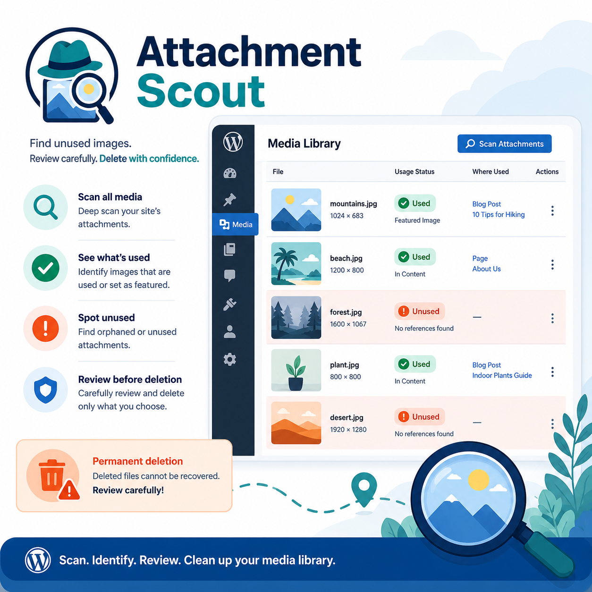

# Attachment Scout
## The Unused Image Finder for WordPress

> Warning: Attachment Scout is a utility plugin that can permanently delete WordPress attachment files. It is not an automated, fully safe cleanup tool. Use it only after taking a full backup of your website and only after reviewing each result carefully.

> Warning: This plugin is a work in progress, provided with no warranty or guarantee. It was created as a utility to help reduce the size of a client's WordPress server footprint. Please back up your site before using it, and test your site after using it.

Attachment Scout is a WordPress utility plugin for reviewing Media Library attachments and identifying files that may be unused or appear to be orphaned. It is intended for manual review and should be used with caution.

## Important notice

This plugin can delete attachment files permanently. Deletions are destructive and may affect your site if an image is still referenced elsewhere. Because of that:

- Always take a full website backup before using it.
- Review the results manually before deleting anything.
- Treat this plugin as a utility for cautious, informed cleanup, not as a fully automated or guaranteed-safe process.

## What it does

Attachment Scout scans WordPress attachment records and helps you review media files that may be unused or appear orphaned. It can display attachment details such as title, URL, size, and whether the attachment appears to be used in the database.

## Usage

1. Install and activate the plugin in WordPress.
2. Open the Attachment Scout page in the admin area.
3. Review the attachments listed.
4. Delete only the items you have verified are safe to remove.

## Compatibility

- Tested with WordPress 7.0.1.
- Intended for use on a backup-protected site with careful manual review.

## Changelog

### 1.1.0
- Deletes generated resized image variants when the original attachment file is removed.
- Adds clearer admin warning messaging before deletion.
- Improves plugin header metadata and compatibility information.
- Adds more detailed inline documentation for maintainers.

## Notes

- This plugin is intended for experienced users and site administrators.
- It does not guarantee that a file is truly orphaned.
- It is not a substitute for a backup, staging environment, or careful testing.
